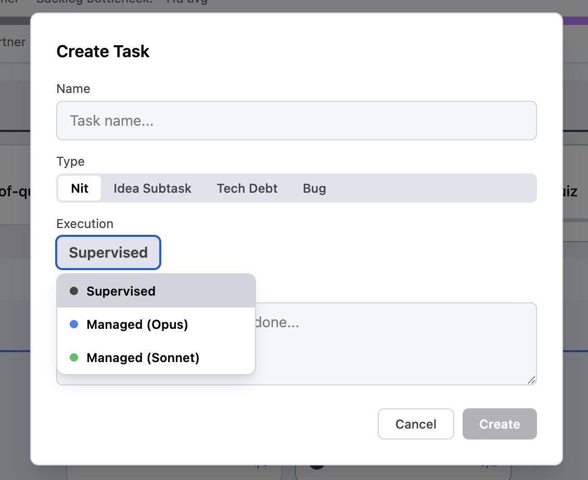
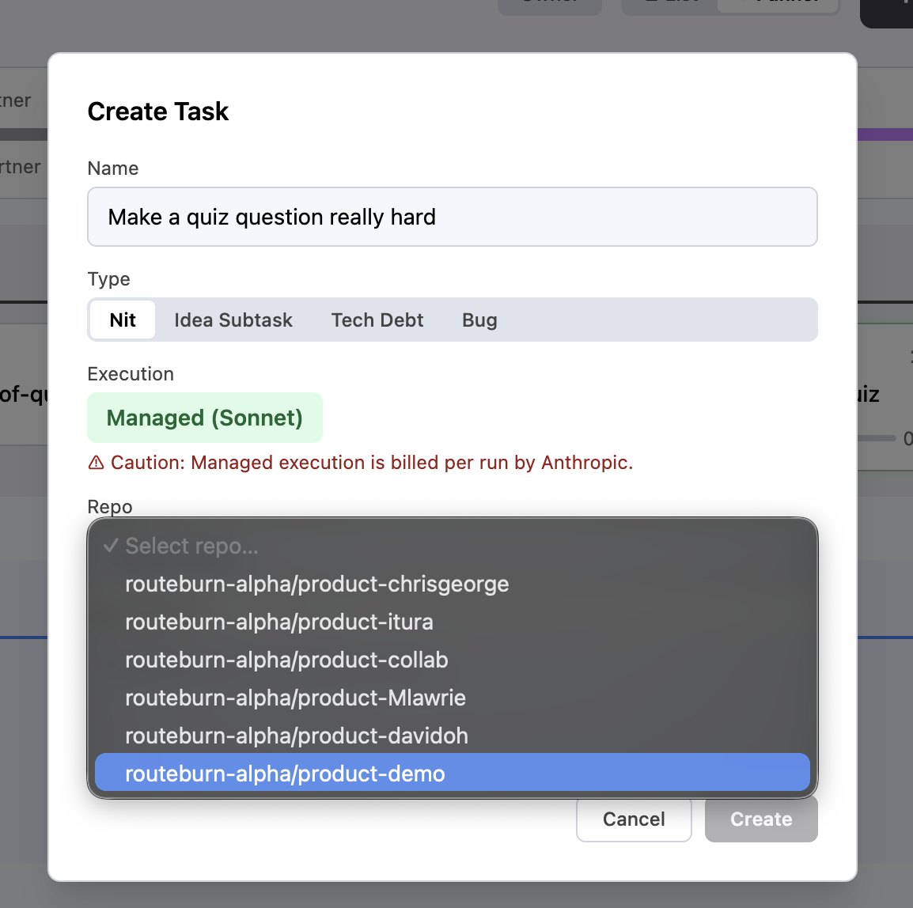
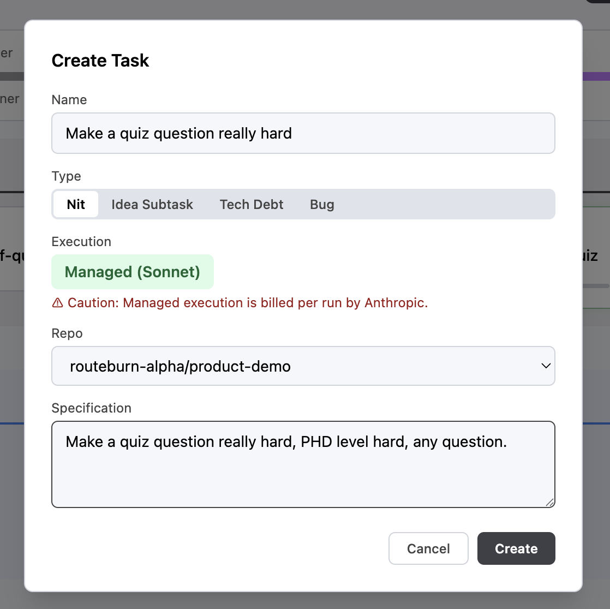
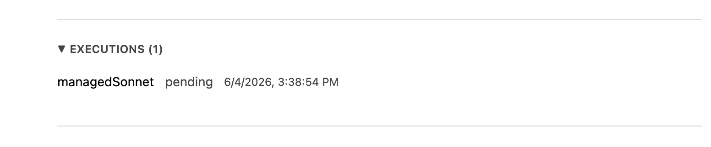
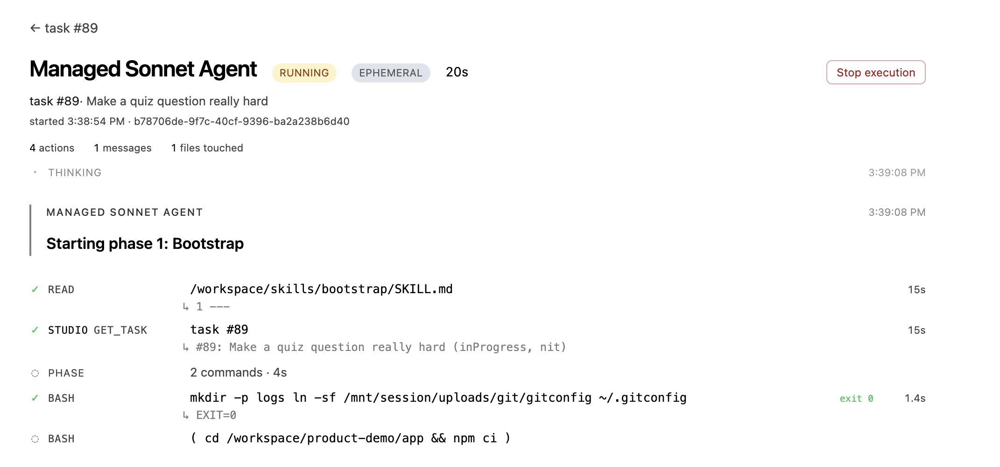
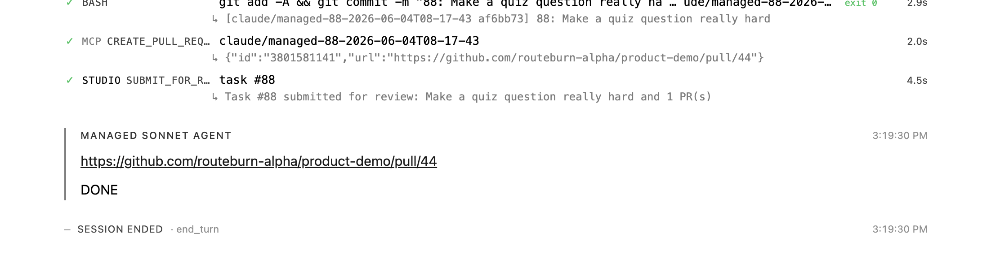
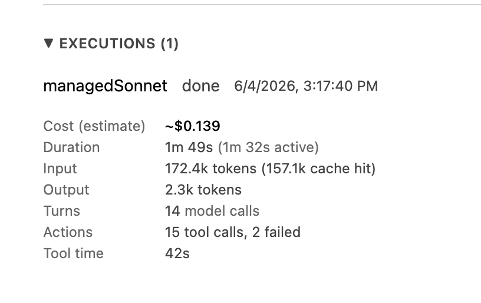

# Managed Tasks

The second lane for shipping work in Studio AI. Where a **supervised** task runs Claude Code locally in your worktree and you pair with it, a **managed** task runs Claude in the cloud against your repo, with no local agent involved.

You stay in control of *what* to build (the spec) and *whether to merge it* (the review). Studio AI handles the rest: cloning the repo, running the agent, opening the PR, submitting for review.

Read [ONBOARDING.md](./ONBOARDING.md) first if you haven't shipped a supervised task yet. The local loop teaches you what a good spec looks like, which is the single biggest input to a managed run going well.

## Prerequisites

- The task has a real **spec**. The managed agent reads it cold and has no chance to ask follow-ups. Vague specs produce vague PRs.
- The product has a **GitHub repo configured** (true by default for alpha products).
- For ideaSubtasks: the parent idea has a technical design (the agent reads it for context).

## Walkthrough

### Part A: Create the task and kick off the run

**1. Open the New Task dialog.** From your product, click **Tasks** in the left nav, then **New Task**.

**2. Pick something tiny and concrete** so the first managed run finishes fast and the result is easy to eyeball. Two good starters for Quiz Lab:

- *"Change the third question in the default quiz to hard difficulty."*
- *"Add a new quiz pack about the TV show Friends with 5 questions."*

**3. Set the Execution to a managed option.** In the Create Task dialog, the **Execution** field defaults to *Supervised*. Click it and pick **Managed (Opus)** or **Managed (Sonnet)**.

**4. Pick the repo.** A **Repo** dropdown appears once Managed is selected. Choose your `routeburn-alpha/product-{your-handle}` repo. (Managed runs need to know which repo to clone; supervised runs don't because they use your local worktree.)

**5. Write the spec in the Specification field.** A few sentences is enough for these. Say what to change, where (file or component name if you know it), and how you'll tell it worked. The managed agent reads what's there and only what's there — no follow-up questions.

**6. Click Create.** The task is created **and** the managed run starts immediately — no separate Execute step. Scroll down on the task page and you'll see an **Executions (1)** section appear in `pending` state.

### Part B: Watch the run

**7. Click into the pending run** to open the run detail page. You'll see the agent walking through phases (Bootstrap, then implementation), with each tool call, bash command, and read/edit logged live.

The page updates live. Leave it open while the agent works — this is the easiest way to learn what a managed run actually does with your spec.

### Part C: Review and merge

**8. Wait for the agent to finish.** When it's done, you'll see it commit, call `MCP CREATE_PULL_REQUEST`, and then `STUDIO SUBMIT_FOR_REVIEW`. The session ends with a `DONE` message linking the PR. The task moves to `review`.

Back on the task page, the Executions section now shows the completed run with cost, duration, and token counts.

**9. Review the PR like a teammate's.** Read the diff. If it touched UI, open the deployed Pages build at `https://routeburn-alpha.github.io/product-{your-handle}/` and click through the change. Leave comments, request changes, or approve.

**10. Merge.** The task auto-transitions to `done` via the GitHub webhook.

## Limits and gotchas

- **Agent locked at backlog.** Once a task leaves backlog, the execution agent (supervised vs managed) can't be changed. Pick before you click Create.
- **No mid-run intervention.** A managed run is fire-and-forget. If it's heading the wrong way, your only lever is to let it finish (or fail) and then iterate on the spec.
- **Cost is real.** Each run consumes Claude tokens. Opus runs on a long task can add up. Watch the cost meter on the run detail page.
- **Repo permissions.** Managed runs push to the same `routeburn-alpha/product-{handle}` repo as supervised. They open a PR, they don't push to main directly.
